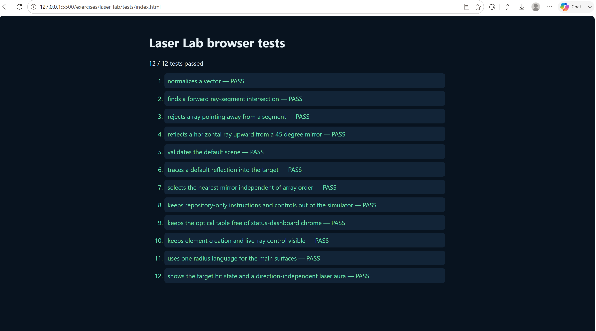
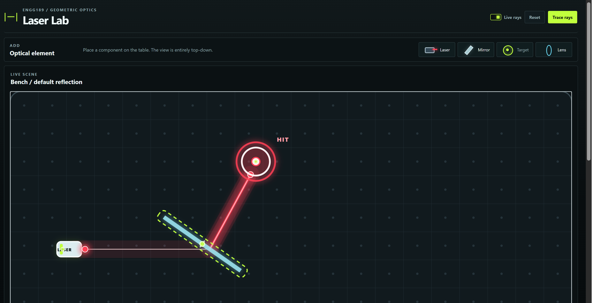
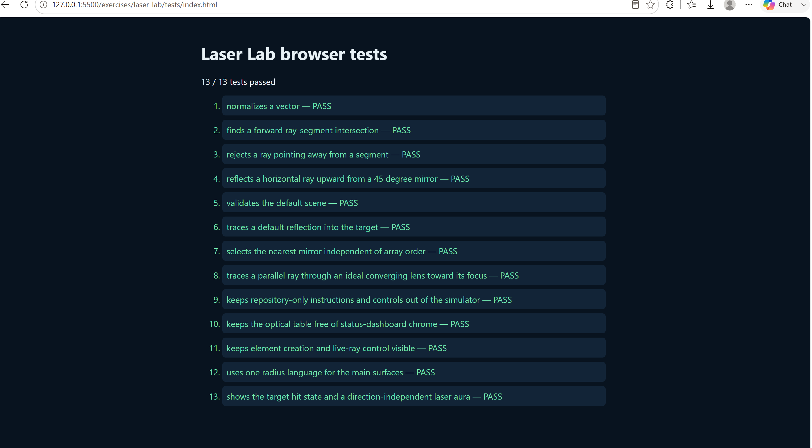
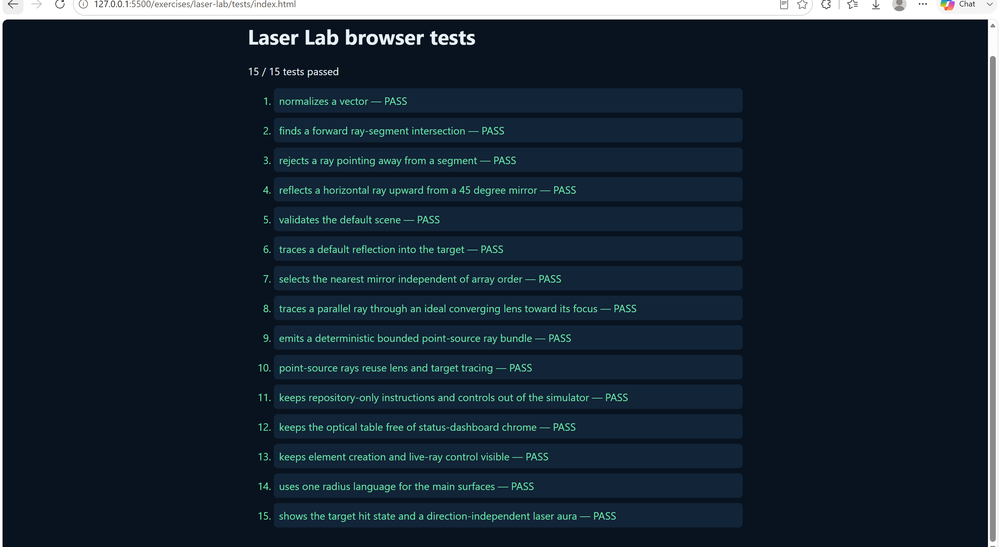
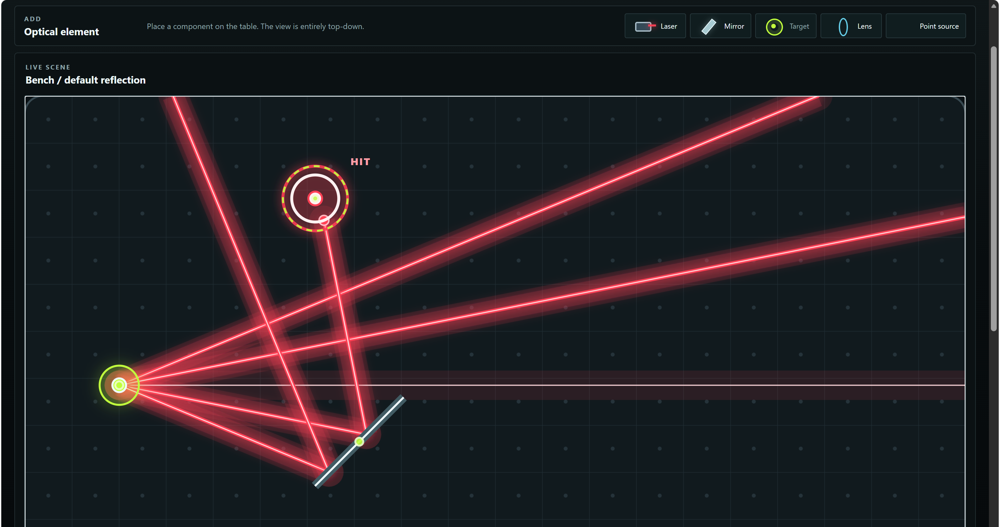

AUTHOR: MARC IGNACIO

# Laser Lab design record

This file is student-authored. Codex may help compare options, but the student chooses the architecture.

## Gate 0: requirements

- What must the first working slice do?

    The first working slice refers to functional baseline of the optics workbench. Based on the origin repository, it's unit tests and the guided answer from codex, it must have the following functions:
    - **Pass baseline browser tests**
        - The slice must pass the automated tests in *~/test/index.html*
    - **Support interactive bench manipulation**
        - Support pointer dragging and rotation handling of the workbench elements
        - Support keyboard controls with arrow keys to nudge and Q/E to rotate
    - **Render Decoupled SVG Visuals**
        - Draw the bench grid, optical elements, laser core paths, and target hit effects in *render.js* without rendering logic into the tracer.
    - **Manage Scene State**
        - Store immutable element state for three basic element kinds: laser, mirror, and target in *scene.js*

- What is deliberately out of scope?

    The following items were excluded in the first working slice:
    - **Lenses and Refraction**
        - Converging/Diverging lenses
        - Snell's law
        - Refracted index media
    - **Multi-Ray Bundles and Point Sources**
        - No point sources
    - **Wave optics and complex physics**
        - No diffraction, interference, polarization, Gaussian beam waist profiles, or absorbtion attenuation
    - **Curved or abitrary geometry**
        - No parabolic or curved mirrors. 
        - No 3D ray tracing
    - **External Runtime/ Build dependencies**
        - No npm packages. Vanilla HTML, CSS, and JS was used to make the slice browser-native.

Non-goals:
  Non-goals for this task are lenses, refraction, point-
  source ray bundles,
  generalized optics abstractions, undo/redo, external
  dependencies, and
  production-code changes. This task only documents the
  existing architecture,
  compares state/update options, and records one design
  decision while preserving
  the baseline behavior.

## State representation

### State stored in the scene

The main simulator state is stored in the scene variable in src/app.js:

```javascript
var scene = S.createDefaultScene();
```

It contains:

```javascript
{
    schemaVersion,
    bounds,
    elements,
    selectedId
}
```

 In line with this, the individual lasers, mirrors, and targets are stored in:

```javascript
scene.elements
```

The selected element is then identified with the attribute

```javascript
scene.selectedId
```

Each element has it's own properties such as:
* position
* angle
* length
* radius
* wavelength
* intensity

Scene changes use functions such as:
* S.updateElement
* S.addElement
* S.removeElement

Since, the variable for the scene is immutable. These clone the scene
and return a new version. Then, app.js replaces the current
state through:

```javascript
function setScene(next, shouldTrace) {
    scene = next;
    redraw(shouldTrace !== false);
}
```

### How pointer and keyboard input become scene updates

 *src/interaction.js* receives pointer and keyboard events from the SVG bench.

* **For pointer dragging:**
  1. pointerdown finds the element ID from its data- element-id.
  2. The pointer position is converted to world coordinates.
  3. actions.select(id) selects the element.
  4. pointermove calculates the movement delta.
  5. actions.move(id, delta) sends the update to app.js.
  6. app.js calls S.updateElement(scene, id, patch).
  7. setScene replaces scene and redraws the simulator.

* **For, keyboard controls**
    1. Arrow keys move the selected elements
    2. Shift makes movement larger.
    3. Q and E rotate the selected element
    4. Delete and Backspace remove the item

The selected element queries by calling:

```javascript
scene.selectedId
```

### How rays are represented and traced

The calculated ray result is stored in the trace variable
in src/app.js:

```javascript
var trace = T.traceScene(scene);
```

src/trace.js creates one ray for each enabled laser in
scene.elements.

Each ray has the following properties:
- origin: laser.position
- direction: calculated from laser.angleRad

The scene tracer checks the table boundary, mirrors, and targets. It chooses the nearest intersection, then stores each ray section in:

```javascript
trace.segments
```

Each segment contains:
```
{
    from,
    to,
    wavelengthNm,
    intensity,
    terminatedBy,
    elementId
}
```

Mirror hits cause the ray direction to be reflected. The ray continues until it reaches a target, the boundary, or the maximum bounce count.

Meanwhile, other tracing results are stored in:
- trace.hits
- trace.rayCount
- trace.targetHitCount

### Separation between tracing and SVG rendering

src/trace.js handles the geometry and optics. It returns data and does not create SVG elements.

src/render.js receives the scene and trace objects through:

R.renderBench(svg, scene, trace);

It converts that data into SVG elements such as:

- beam lines and glow effects;
- laser graphics;
- mirror graphics;
- target graphics;
- target hit effects;
- selection outlines.

The overall flow is:

scene → trace → render

app.js coordinates the process:

scene state → T.traceScene(scene) → R.renderBench(svg,
scene, trace)

### Where the tests observe behavior

The tests are in tests/index.html.

They directly test the geometry, scene, and tracing
modules:

- LaserLabGeometry
- LaserLabScene
- LaserLabTrace

They check:

- vector normalization;
- ray/segment intersections;
- rejection of backward rays;
- reflection direction;
- default scene validation;
- reflection into the target;
- nearest-mirror selection.

The tests also load the simulator in a hidden iframe and inspect its actual DOM. They verify:

- instructions are kept outside the simulator;
- unwanted dashboard elements are absent;
- element creation controls are visible;
- the live-trace checkbox exists and starts enabled;
- surface corner radii are consistent;
- the default target displays a hit;
- the laser displays an aura.

In short:

```
Scene interaction → app.js updates scene → trace.js calculates
```

Then,
``` 
trace → render.js draws SVG
```

The primary state variable is scene; the calculated
optical result is stored separately in trace.

### Option A: Centralized application store

Keep one authoritative scene variable in app.js. All user
actions call app-level functions such as move, rotate,
select, and remove. Those functions update the scene
through Scene.updateElement, then retrace and rerender.

interaction.js
    → app.js action
    → scene.js immutable update
    → trace.js
    → render.js

Advantages:

- Simple and easy to understand.
- Keeps interaction, state, tracing, and rendering
separate.

- Fits the current code structure.
- Easy to add undo/reset behavior later.

Trade-offs:

- app.js can become large as more element types and
actions are added.

- Actions are passed around manually.
- Testing updates may require setting up the application
layer.

### Option B: Reducer-based state updates

Represent every user action as an action object, then
send it to one reducer function:

```javascript
scene = reducer(scene, {
type: "MOVE_ELEMENT",
id: "mirror-1",
delta: { x: 2, y: 0 }
}); → render.js
```

Advantages:

- All state transitions are centralized and explicit.
- Easier to test state changes independently.
- Makes undo/redo, action logging, and replay easier.
- Scales better when the number of interactions grows. sufficient for lasers, mirrors, targets, dragging, keyboard controls, and reset behavior. A reducer would become more useful if the simulator later gained undo/redo, many element types, or complex multi-step updates.

Trade-offs:

- Requires more code: action objects, dispatch, and a reducer.

- The update path is less direct and may be harder for beginners to follow.

- Every action needs a defined format and type.
- A large reducer can become difficult to maintain.
- Small changes may require editing multiple places.
- It may be unnecessary complexity for this small simulator.

### Decision

I choose: **Option B: Reducer-based state updates**

Reason: This is my choice because it scales better when the number of possible interactions with the scene grows. This is because with a reducer-based approach I can add action types such as:

```
  { type: "MOVE_ELEMENT", id, delta }
  { type: "ROTATE_ELEMENT", id, angle }
  { type: "ADD_ELEMENT", kind }
  { type: "REMOVE_ELEMENT", id }
  { type: "SET_LENS_FOCAL_LENGTH", id, value }

```

This is much better than adding many urelated update function. This means that the reducer becomes the single place that I need to edit in order to define how each action changes a state.

Hence, while the complexity of the implementation is becomes a little more complex the following benefits are obtained:
- since actions are isolated, the code becomes easier to test
- log and replay user action can be implemented
- pointer controls, keyboard controls, and inspector controls can remain consistent
- new elements can be added without creating state-management patterns

An action such as:

```
{
type: "MOVE_ELEMENT",
id: "mirror-1",
delta: { x: 10, y: 0 }
}
```

would be independent from the interaction that invoked it. It would not matter if it is a keyboard or mouse that called the action, only the action invoked would matter for updating the scene.

## Rendering and interaction

How will simulation state, SVG rendering, and pointer input remain separate?

Simulation state, SVG rendering, and pointer input are strictly separated through a unidirectional data flow:
1. **Pointer & Keyboard Input (`interaction.js`):** Listens to DOM/SVG events and translates raw input into semantic intent/actions without mutating state directly or performing geometric optics calculations.
2. **Simulation State (`scene.js` / `app.js`):** Holds the authoritative immutable scene model. It updates element properties purely in response to actions and produces a new scene state.
3. **Ray Tracing Pipeline (`trace.js`):** Takes a snapshot of the scene state and computes optical ray paths, intersections, and hit records purely as data structures with no DOM or rendering dependencies.
4. **SVG Rendering (`render.js`):** Receives the scene and trace data purely as read-only inputs to update the SVG DOM. It has no internal simulation state and performs no physics calculations.

## Evidence

- Gate or task: **Task 1**
- Browser test page and result:


- Screenshot or observation: No code was changed in this task. Hence, the tests should remain unchanged as expected.

- Commit: laser-lab: record architecture decision

## Task 3: Point source rays

## Architectural options

1. **Lens as a scene element handled inside trace.js — recommended**

Add a lens element with:

```javascript
{ id, kind: "lens", center, angleRad, length, focalLength }
```
The lens is a finite line segment. When a ray intersects it, calculate the intersection’s signed height from the
optical axis and redirect the ray toward the focal point on the outgoing side. Positive focal length means a
converging lens; negative means diverging. This reuses the existing nearest-intersection and segment pipeline
cleanly.

2. **Separate lens rule after existing intersections**

Keep lenses outside the normal scene-element collision set and apply a dedicated optical rule after a ray reaches a
predetermined lens plane. This keeps the existing intersection logic mostly unchanged, but makes lens placement, selection, rendering, and future interactions less consistent with mirrors and targets.

## Decision

Choice: Option 1 - Lens as scene element

Reason: This will remain consistent with the program structure and allows code to be reused to prevent the duplication or creation of functions with similar functions.

### Bounded model

- The lens is a finite vertical segment when `angleRad` is zero. Its local horizontal direction is the optical axis; rotating the element rotates both the segment and axis.
- Positive `focalLength` means a converging lens and negative `focalLength` means a diverging lens.
- An incoming ray is represented by its origin and normalized direction, as in the existing tracer. At the lens intersection, the outgoing direction points from the hit point to the signed focal point on the outgoing side of the lens.
- The lens uses the existing nearest-intersection and segment pipeline. It does not create extra rays, alter intensity, or model thickness, refraction, chromatic effects, or aberration.

The rejected separate-rule approach would apply lens behavior outside the normal scene-element intersection path. It was rejected because it would make placement, selection, rendering, and future interaction inconsistent with the existing optical elements.

## Evidence

- Gate or task: **Task 2**
- Browser test page:


- Browser result:



- Screenshot or observation: The simulator now exposes a Lens creation control and renders the lens as a selectable optical element. A focused trace check sends an off-axis parallel ray through a converging lens and verifies that the outgoing slope is -0.5, matching a focal point 100 units to the right of the lens center.

- Commit: add ideal thin lens

## Task 3: implement a point source with multiple rays

## Architectural options
  1. **Expand the bundle before the existing tracer**

  Treat a point source as producing a fixed list of ordinary laser-like rays at the source
  boundary. Each ray then enters the existing mirror, lens, target, segment, and hit pipeline.

  Advantages:

  - Reuses the current tracer with minimal changes.
  - Keeps each ray independently testable.
  - Makes stable ordering and bounded ray count straightforward.
  - Separates measured rays from the decorative source aura.

  Trade-off: The application must manage the expansion of rays from the single point source

  2. **Let the tracer fan out from a point-source element**

  Add point-source handling directly inside traceScene. The tracer creates several directions when it encounters the source and traces them internally.

  Advantages:
  - The source-to-ray relationship is centralized in the tracer.
  - The scene can represent the source as one optical element.

  Trade-offs:
  - Couples source emission rules to the tracing loop.
  - Makes ray-count and ordering behavior less explicit.
  - Requires more changes to the existing laser-oriented pipeline.

## Decision

Choice: Option 1

Reason: Option 1 is a more deterministic approach because by design it will have a bounded ray count and it will take advantage of existing code for the implementations. Since the point-source will be like an array of lasers, then the laser object with its functionality can be reused.

## Evidence

- Gate or task: **Task 3**

- Browser result:


- Browser result: 15 / 15 browser tests passed, including deterministic emission and lens/target pipeline regression checks.

- Browser test page:


- Screenshot or observation: The simulator exposes a Point source control and renders a separate source aura; emitted rays are traced as ordinary beam segments.

- Commit: laser-lab: add point source rays

## Revision log

Record what changed after an unexpected result or failed test.
